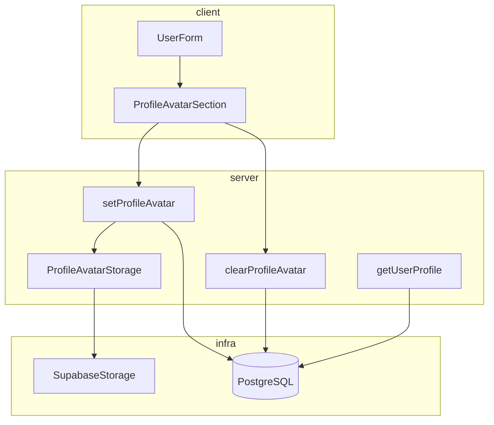
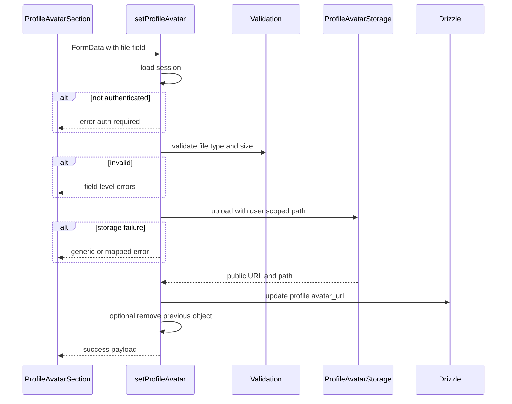
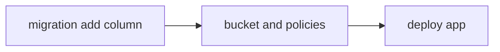

# 設計書: profile-image

## Overview

認証済みユーザーがプロフィール用の画像をアップロード・差し替え・削除し、ダッシュボードのプロフィール表示で確認できるようにする。既存の `profile` ドメイン（`getUserProfile` / `UserForm` / `ProfileCard` / `submitProfileForm`）を拡張し、バイナリは **Supabase Storage** に置き、参照 URL は **PostgreSQL の `profile` 行**に保持する。

**利用者**: ログイン済みユーザーがダッシュボードのプロフィール登録・編集フローで利用する。

**影響**: `db/schema` の `profile` に nullable カラムが追加される。サーバーに Storage 書き込み用の認証情報と、Next.js の画像最適化用リモートホスト設定が追加される。既存のテキスト専用プロフィール保存 action は、画像カラムを上書きしないよう契約を維持する。

### Goals

- 本人のみが自分の `profile.avatar_url` を更新・削除できる。
- 許可 MIME・最大サイズをサーバーで強制し、利用者に分かるエラーを返す。
- プロフィール表示で画像・プレースホルダー・読み込み失敗時のフォールバックを提供する。
- テキストプロフィール保存でアップロード済み画像を意図せず消さない。

### Non-Goals

- サーバー側の高度な画像処理（リサイズ・クロップ必須化）。要件上「手段は対象外」のため、初期リリースでは **バリデーションと保存に限定**し、加工は将来拡張とする。
- CDN 以外の配信方式の詳細チューニング。
- 管理者による他ユーザーの画像代理変更。
- `user.image` をプロフィール保存 action 内で毎回同期更新すること（表示フォールバックのみ利用）。

## Architecture

### Existing Architecture Analysis

- **パターン**: Server Actions（`app/actions/profile.ts`）、データ取得（`app/data/profile.ts`）、Zod（`app/schema.ts`）、Conform + `useActionState`（`UserForm`）。
- **境界**: プロフィール属性は `profile` テーブル。Better Auth の `user` テーブルには既に `image` カラムがあるが、現行 UI は未使用。
- **維持する慣習**: `"use server"` の配置、`revalidatePath`、認証は `auth.api.getSession` と同一パターン。

### Architecture Pattern & Boundary Map

**選択パターン**: **拡張ドメイン + 専用コマンド境界**（テキスト用 `submitProfileForm` と画像用 Server Action を分離し、同一画面で合成）。

**境界**:

- **表示・入力**: `UserForm` / `ProfileCard`（クライアント＋既存レイアウト）。
- **画像コマンド**: 新規 Server Action モジュール（例: `app/actions/profile-avatar.ts`）。認証・バリデーション・アップロード・DB 更新を一連で担当。
- **ストレージアダプタ**: サーバー専用の薄いラッパ（例: `lib/storage/profile-avatar.ts`）。Supabase Storage への依存をここに閉じる。
- **読み取り**: `getUserProfile` が `profile` と `user.image` をまとめて返す拡張（フォールバック用フィールドを追加）。

**Steering 整合**: `app/actions/` と `app/data/` のドメイン分割、`app/components/` の機能コンポーネント配置に従う。



### Technology Stack

| Layer | Choice / Version | Role in Feature | Notes |
| ----- | ---------------- | --------------- | ----- |
| Frontend | Next.js 16 App Router、React 19 | 画像選択・プレビュー、`next/image` 表示 | `next.config` に remotePatterns 追加 |
| Backend | Server Actions、Node.js 20+ | multipart 受信、検証、DB・Storage 更新 | 既存 `auth` パターン踏襲 |
| Data / Storage | PostgreSQL、Drizzle ORM | `profile.avatar_url` | マイグレーション追加 |
| Data / Storage | Supabase Storage、`@supabase/supabase-js` | オブジェクト保存・削除 | **新規依存**。service role はサーバーのみ |
| Validation | Zod 3.x | MIME・サイズ・File 存在チェック | サーバー境界で最終判定 |
| Auth | Better Auth | セッション検証 | 未認証時はフィールドまたはフォームエラー |

## System Flows

### アップロードおよび差し替え



### 表示時の URL 解決

- **優先**: `profile.avatar_url` が非 null ならそれを `next/image` の `src` に使用。
- **次点**: null のときのみ `user.image` を使用（OAuth 等で既に設定されている場合）。
- **どちらも無い**: プレースホルダー（イニシャル・アイコン等）。
- **`next/image` エラー**: `onError` でプレースホルダーに切替（要件 2.3）。

## Requirements Traceability

| Requirement | Summary | Components | Interfaces | Flows |
| ----------- | ------- | ---------- | ---------- | ----- |
| 1.1 | 有効画像の永続化 | setProfileAvatar, ProfileAvatarStorage, Drizzle | Server Action | アップロードシーケンス |
| 1.2 | 差し替え | setProfileAvatar, optional remove | Storage + DB | アップロードシーケンス |
| 1.3 | 未認証拒否 | setProfileAvatar, clearProfileAvatar | Server Action | 分岐 |
| 1.4 | 本人のみ | 全 Action | session.user.id | 不変条件 |
| 2.1 | 設定済み表示 | ProfileCard, next/image | ProfileDisplayProps | — |
| 2.2 | 未設定表示 | ProfileCard | プレースホルダー | — |
| 2.3 | 取得失敗表示 | ProfileCard | onError フォールバック | — |
| 3.1–3.3 | 検証とエラー | setProfileAvatar, Zod | エラー型 | 分岐 |
| 3.4 | 事前説明 | ProfileAvatarSection | ヘルプ文言 | — |
| 4.1–4.3 | 削除 | clearProfileAvatar | Server Action | 簡易フロー |
| 5.1 | 他属性で画像保持 | submitProfileForm, toProfileRecord | upsert 契約 | — |
| 5.2 | 成功失敗フィードバック | ProfileAvatarSection | action result 型 | — |
| 5.3 | 編集 UI 一貫性 | UserForm 内配置 | 合成 | — |

## Components and Interfaces

| Component | Domain | Intent | Req Coverage | Key Dependencies | Contracts |
| --------- | ------ | ------ | ------------ | ---------------- | --------- |
| ProfileAvatarSection | UI | 選択・プレビュー・制約表示・送受信 | 1.x, 3.x, 4.x, 5.2, 5.3 | setProfileAvatar, clearProfileAvatar P0 | State |
| ProfileCard | UI | 表示・フォールバック | 2.x | ProfileDisplayData P0 | Props |
| setProfileAvatar | Server Action | アップロード処理 | 1.1, 1.2, 1.3, 1.4, 3.x | Auth P0, Storage P0, DB P0 | Service |
| clearProfileAvatar | Server Action | URL クリアと任意ストレージ削除 | 4.x | Auth P0, DB P0, Storage P1 | Service |
| getUserProfile | Data | 読み取りモデル拡張 | 2.x, 5.1 | Drizzle P0 | Service |
| ProfileAvatarStorage | Infrastructure | Storage I/O の単一窓口 | 1.x, 4.x | supabase-js P0 | Service |
| submitProfileForm | Server Action | 既存テキスト保存 | 5.1 | 変更は画像非タッチのみ確認 | Service |

### UI

#### ProfileAvatarSection

| Field | Detail |
| ----- | ------ |
| Intent | ファイル入力、クライアント側プレビュー、制約ヘルプ、送信中状態、結果メッセージ |
| Requirements | 3.1, 3.2, 3.3, 3.4, 5.2, 5.3 |

**Responsibilities & Constraints**

- `UserForm` 内に配置し、テキストフィールドと視覚的に一体のカード内に収める。
- 送信は **専用 Server Action** を呼ぶ。テキスト `submitProfileForm` とは Form を分けない場合、ネストした `form` は HTML 上無効のため **単一 form 外の button + action 参照** または **明示的に独立 form** を採用し、アクセシビリティを維持する（実装タスクで具体化）。

**Dependencies**

- Inbound: `UserForm` — レイアウト枠（P1）
- Outbound: `setProfileAvatar`, `clearProfileAvatar` — 永続化（P0）

**Contracts**: State

##### State Management

- State model: `idle` / `submitting` / `success` / `error`（メッセージとフィールドエラー）
- 成功時: 親が `router.refresh` または Server Action 側 `revalidatePath` により RSC が再取得
- 同時実行: 連打防止のため送信中はボタン無効化

**Implementation Notes**

- Integration: 制約定数（最大バイト、許可 MIME）は `app/schema.ts` または専用モジュールで共有し、UI ヘルプとサーバー Zod で同一値を参照。
- Validation: クライアントは補助的。最終判定はサーバー。
- Risks: 大きなファイルのメモリピーク — サイズ上限を厳しめに設定。

#### ProfileCard

| Field | Detail |
| ----- | ------ |
| Intent | プロフィール要約表示にアバター領域を追加 |
| Requirements | 2.1, 2.2, 2.3 |

**Dependencies**

- Inbound: `ProfileDisplayData`（P0）

**Contracts**: Props

**Implementation Notes**

- `next/image` の `src` に外部 URL を渡すため、`next.config` の `images.remotePatterns` に Supabase 公開ホストを登録。
- Risks: 外部 URL 形状変更 — 設定を環境変数または定数で一元化。

### Server / Data

#### setProfileAvatar

| Field | Detail |
| ----- | ------ |
| Intent | 認証済み本人のファイルを検証し Storage に保存、`profile.avatar_url` を更新 |
| Requirements | 1.1, 1.2, 1.3, 1.4, 3.1, 3.2, 3.3 |

**Responsibilities & Constraints**

- セッション必須。`userId` はセッションからのみ取得し、クライアント入力で上書き不可。
- オブジェクトキーは `userId` プレフィックス付きでパストラバーサルを防ぐ。
- 更新前に既存 `avatar_url` が同一バケット配下を指す場合、**ベストエフォートで削除**（失敗しても新 URL の保存は完了可とするか、実装タスクでトランザクション方針を確定）。

**Dependencies**

- Inbound: `FormData`（P0）
- Outbound: `ProfileAvatarStorage`（P0）、Drizzle（P0）、`auth`（P0）

**Contracts**: Service

##### Service Interface

```typescript
type SetProfileAvatarSuccess = { status: "success"; avatarUrl: string };
type SetProfileAvatarFailure = {
  status: "error";
  formErrors: string[];
  fieldErrors: Record<string, string[]>;
};

type SetProfileAvatarResult = SetProfileAvatarSuccess | SetProfileAvatarFailure;

declare function setProfileAvatar(
  prevState: SetProfileAvatarResult | undefined,
  formData: FormData
): Promise<SetProfileAvatarResult>;
```

- Preconditions: セッション有効、`FormData` に対象フィールドが存在。
- Postconditions: 成功時 `profile.avatar_url` が新 URL、パス再検証済み。
- Invariants: 他ユーザーの行を更新しない。

#### clearProfileAvatar

| Field | Detail |
| ----- | ------ |
| Intent | `profile.avatar_url` を null にし、判別可能なら Storage オブジェクトを削除 |
| Requirements | 4.1, 4.2, 4.3 |

**Contracts**: Service

```typescript
type ClearProfileAvatarSuccess = { status: "success" };
type ClearProfileAvatarFailure = {
  status: "error";
  formErrors: string[];
};

type ClearProfileAvatarResult =
  | ClearProfileAvatarSuccess
  | ClearProfileAvatarFailure;

declare function clearProfileAvatar(
  prevState: ClearProfileAvatarResult | undefined,
  formData: FormData
): Promise<ClearProfileAvatarResult>;
```

#### getUserProfile

| Field | Detail |
| ----- | ------ |
| Intent | 既存フィールドに加え `avatar_url` と表示用フォールバック `oauthImageUrl` を返す |
| Requirements | 2.1, 2.2, 5.1 |

**Contracts**: Service

```typescript
type ProfileDisplayData = {
  name: string;
  gender: string;
  birthDate: string;
  note: string | null;
  bloodType: string | null;
  avatarUrl: string | null;
  oauthImageUrl: string | null;
};
```

- `oauthImageUrl` は `user.image` を join または副クエリで取得。プロフィール行が無い場合の挙動は既存仕様に従い、画像のみ先行表示が必要ならダッシュボードのデータ合成で扱う（実装タスクで確定）。

#### ProfileAvatarStorage

| Field | Detail |
| ----- | ------ |
| Intent | Supabase Storage への put/remove を集約 |
| Requirements | 1.1, 1.2, 4.1 |

**Contracts**: Service

```typescript
type StoragePutResult =
  | { ok: true; publicUrl: string; objectPath: string }
  | { ok: false; code: "upload_failed" | "invalid_config" };

interface ProfileAvatarStorage {
  put(input: {
    userId: string;
    bytes: Uint8Array;
    contentType: string;
    fileExtension: string;
  }): Promise<StoragePutResult>;

  remove(input: { objectPath: string }): Promise<{ ok: true } | { ok: false }>;
}
```

- 実装は `@supabase/supabase-js` の service role クライアントを使用。環境変数名は実装タスクで `.env.example` に追記。

## Data Models

### Logical Data Model

- **Entity `profile`**: 既存の 1:1 `user` 関係を維持。新属性 `avatar_url`（nullable string）は「アプリ管理のプロフィール画像 URL」を表す値オブジェクト的な文字列。
- **Entity `user`**: `image` は読み取り専用フォールバック用。本機能の正は `profile.avatar_url`。

### Physical Data Model

- **Table `profile`**: カラム `avatar_url` type `text`, nullable, インデックス不要（検索キーにしない）。
- **Referential integrity**: 既存 `user_id` FK を維持。
- **マイグレーション**: 新規 Drizzle マイグレーションで `ADD COLUMN`。既存行は null。

### Data Contracts & Integration

- **Server Action 入力**: `FormData` 内の単一ファイルフィールド名を設計上固定（例: `avatar`）。実装で定数化。
- **許可 MIME**: 例として `image/jpeg`, `image/png`, `image/webp`（実装タスクで最終確定）。
- **最大サイズ**: 例として 2〜5 MiB 範囲でプロダクト決定（要件の「許容サイズ」に合わせる）。

## Error Handling

### Error Strategy

- **検証エラー**: Zod または手続き的チェックで `fieldErrors` を返し、UI はフィールド横に表示。
- **認証エラー**: `formErrors` に「ログインが必要です」相当の単一メッセージ。
- **Storage / DB エラー**: 利用者向けは汎用メッセージ、サーバーログに詳細。リトライは初期実装では不要。

### Error Categories and Responses

- **User Errors**: 形式・サイズ不正 — フィールドメッセージ。未認証 — フォームレベル。
- **System Errors**: Storage 障害 — 保存失敗メッセージ、ロギング。
- **Business Logic**: なし（本人制約は認証で処理）。

### Monitoring

- アップロード失敗・削除失敗をサーバーログに記録。個人情報（ファイル名の元名）はログに出さないかマスク。

## Testing Strategy

- **単体**: バリデーション純関数（MIME・サイズ・空ファイル）を `*.test.ts` で振る舞い単位検証。
- **結合**: `setProfileAvatar` をテスト DB とモック Storage またはテストバケット方針で検証（プロジェクト方針に従い、プロセス外のみモック）。
- **UI**: `ProfileAvatarSection` のレンダリングとエラー表示を Testing Library で検証。
- **E2E**: 任意だが、ファイル選択から表示更新までを Playwright で 1 本化する価値あり（CI でのファイルアップロード設定要検討）。

## Security Considerations

- **認証・認可**: すべての画像コマンドでセッション必須。`userId` はサーバー導出。
- **入力**: 許可 MIME のホワイトリスト、最大サイズ、空ファイル拒否。
- **ストレージ**: バケットポリシーで匿名書き込みを禁止。読み取りは公開バケットまたは署名 URL 方針を環境ごとに固定。
- **秘密情報**: service role キーをクライアントに送らない。

## Performance & Scalability

- 画像はエッジキャッシュ可能な公開 URL を想定。高トラフィック時は CDN 設定を Supabase 側で活用。
- アップロードはユーザーあたり低頻度のため、初期段階では専用キュー不要。

## Migration Strategy

1. Drizzle で `profile.avatar_url` を追加するマイグレーションを生成・適用。
2. Supabase で Storage バケット作成とポリシー設定。
3. アプリケーションコードデプロイ。
4. ロールバック: カラムを残したまま機能フラグで UI 非表示も可（フラグは任意）。



## Supporting References

- 詳細な調査ログと却下案: `.kiro/specs/profile-image/research.md`
