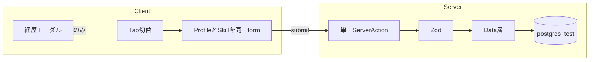

# エンジニアスキルシート機能のテストケース設計（Vitest / it.todo のみ）

## 前提（ユーザー回答の反映）

- **保存**: プロフィール編集タブとスキルシート編集タブで **同じ1つの「保存」ボタン** を使い、**1回の送信でプロフィールとスキルシートの両方をまとめて保存**する。
- **経験年数**: **0〜N の整数**（N は実装で定数化。テスト名では「設定された上限値」と表現し、境界は 0 / N / N+1 を列挙）。
- **モック非前提**: ケース名・階層は **純粋関数（Zod/変換）** と **実DB結合（`*.test.ts`）**、および **jsdom で実際の DOM 操作・観測可能な結果** を主眼にする。`vi.mock` でモジュール差し替えを前提にしたケースは書かない（※既存の `profile` 結合テストが auth をモックするのはプロセス外依存の技術制約であり、ケース名は「未認証のとき〜」のように **観測結果** で表現する）。

## 想定する責務分割（テストファイルの置き場所）

実装は未着手のため、以下は **推奨コロケーション** です。実際のファイル名は実装に合わせて調整する。

| 層               | 推奨パス例                                                                                                                                                               | 主な検証              |
| --------------- | ------------------------------------------------------------------------------------------------------------------------------------------------------------------- | ----------------- |
| ドメイン／バリデーション    | `[libs/skill-sheet/skill-sheet-schema.test.ts](libs/skill-sheet/skill-sheet-schema.test.ts)` または `[app/schema/skill-sheet.test.ts](app/schema/skill-sheet.test.ts)` | Zod 等の純粋バリデーション   |
| データ取得・永続化       | `[app/data/skill-sheet.test.ts](app/data/skill-sheet.test.ts)`（または `profile` と統合するなら `[app/data/profile.test.ts](app/data/profile.test.ts)` へ追記）                    | 実DBでの読み書き         |
| サーバーアクション       | `[app/actions/profile.test.ts](app/actions/profile.test.ts)` に追記、または `[app/actions/skill-sheet.test.ts](app/actions/skill-sheet.test.ts)`                           | 認証・バリデーション・永続化の結合 |
| UI（タブ・モーダル・動的行） | `[app/components/ProfileEditorTabs.test.tsx](app/components/ProfileEditorTabs.test.tsx)` 等（実装コンポーネント名に合わせる）                                                         | 表示・操作・送信の観測可能な結果  |

データモデル（JSON カラム／別テーブル）は **未確定** のため、結合テストのケース名は「保存後に再取得した値が一致すること」のように **振る舞い** で記述する。

## データフロー（実装の指針用）

## `describe` / `it.todo` 階層案（コメントは各 `it.todo` 直前に付与）

以下を **そのまま** 各テストファイルに分割配置する。本文は `it.todo("…")` のみ（`arrange` / `expect` / `vi.mock` は書かない）。

### A. スキルシート入力スキーマ（純粋関数）

`describe("skillSheetSchema（仮称）")` を想定。

- **経験年数（0〜N の整数）**
  - `it.todo` 名例: **経験年数が0のとき、パースに成功すること**
  - **経験年数が上限Nのとき、パースに成功すること**
  - **経験年数が負の整数のとき、エラーであること**
  - **経験年数が上限Nより大きいとき、エラーであること**
  - **経験年数が小数のとき、エラーであること**
  - **経験年数が未入力のとき、エラーであること**（必須とする場合）
  - コメント意図: 境界値（0/N）と型・必須の契約を固定する。
- **所有スキル（テキスト）**
  - **空文字のとき、エラーであること** または **空文字を許容する仕様なら成功すること**（仕様確定後に片方を削除）
  - **最大文字数ちょうどのとき、成功すること**
  - **最大文字数を1文字超過するとき、エラーであること**
  - コメント意図: 長さ制約と「空」の扱いを文書化する。
- **経歴行（複数行・各行に期間・プロジェクト名・概要・使用スキル）**
  - **経歴が0行のとき、成功すること**（許容する場合）／**エラーであること**（必須の場合）— 仕様確定で1つに絞る
  - **各行で開始年と終了年が同じ年のとき、成功すること**（許容する場合）
  - **開始年が終了年より後のとき、エラーであること**
  - **必須フィールド（プロジェクト名・概要・使用スキル等）が空のとき、エラーであること**（どれを必須にするか実装に合わせて調整）
  - **行が最大件数ちょうどのとき、成功すること**
  - **行が最大件数を超えるとき、エラーであること**
  - コメント意図: 期間の論理整合と可変長リストの境界を固定する。

### B. 経歴の「表示用」整形（任意の純関数がある場合）

モーダルやカードで使う **年月の表示フォーマット** や **行の連結** が `libs/` に分離されるなら同様に `describe` を切る。

- **期間とプロジェクト名と概要が与えられたとき、所定の区切り文字で1行にまとまること**
- **概要が空のとき、表示から除外されること**（仕様に応じて）

※ 表示ロジックがコンポーネント内に閉じる場合は **セクション D の UI テスト** に寄せてよい。

### C. データ層（`*.test.ts` / 実DB）

`describe("getSkillSheet / upsertSkillSheet（仮称）")` または `profile` 統合。

- **スキルシートが未保存のユーザーのとき、null または空の既定値が返ること**
- **有効なデータを保存したあと、同じ userId で取得すると保存内容が一致すること**
- **既存データがある状態で更新すると、旧値が上書きされ取得結果が新値になること**
- **他ユーザーのデータが混入しないこと**（userId スコープの分離）
- コメント意図: 永続化の契約とテナント分離を担保する。

### D. 単一 Server Action（プロフィール＋スキルシート同時保存）

`describe("submitProfileAndSkillSheet（仮称）")`。

- **セッションが無いとき、未認証として失敗すること**（既存 `profile` テスト方針に合わせる）
- **プロフィール側のバリデーションが失敗するとき、スキルシートが正しくても保存されないこと**
- **スキルシート側のバリデーションが失敗するとき、プロフィールが正しくても保存されないこと**
- **両方とも有効なとき、プロフィールとスキルシートが一括で永続化されること**
- コメント意図: 「1回の送信」のトランザクション／失敗時の一貫性を固定する（実装がトランザクションなら結合テストで確認）。

### E. UI（タブ・共通保存・経歴モーダル・動的行）

クライアントコンポーネントを `describe` 分割。

1. **タブ切替**
  - **スキルシートタブを選んだとき、スキルシート用フィールドが表示されること**
  - **プロフィールタブを選んだとき、プロフィール用フィールドが表示されること**
  - **タブを往復しても、編集中の入力値が失われないこと**（同一 `form` 前提の振る舞い）
  - コメント意図: 単一フォームでの状態保持を文書化する。
2. **共通の保存ボタン**
  - **どちらのタブを表示中でも、同じラベルの保存ボタンが1つだけ存在すること**
  - **スキルシートタブ表示中に保存を押したとき、プロフィールとスキルシートの入力がまとめて送信対象になること**（観測: `FormData` または送信ハンドラに渡る値—実装が分かれても「欠けない」こと）
  - コメント意図: 「共通保存」の UI 契約を固定する。
3. **経歴表示モーダル（プロフィール表示画面）**
  - **経歴表示ボタンが存在し、押下でモーダルが開くこと**
  - **モーダルが開いているとき、保存済みの経歴内容が読めること**
  - **閉じる操作（×／オーバーレイ／閉じるボタン等、実装に合わせる）でモーダルが閉じること**
  - **経歴が空のとき、空であることがユーザーに伝わる表示であること**
  - コメント意図: 閲覧専用の経路が編集と独立していることを示す。
4. **経歴行の追加（一行ずつ追加）**
  - **行を追加すると、新しい入力欄のセットが1行分増えること**
  - **複数回追加すると、行数がその回数だけ増えること**
  - **各行に独立して入力でき、保存に反映されること**（結合テストまたは UI からの送信確認に寄せる）
  - コメント意図: 可変行 UI の最低限の振る舞いを固定する。

### F. アクセシビリティ／ラベル（必要なら）

- **経験年数プルダウンにアクセシブル名が関連付けられていること**
- **モーダルが開いたとき、フォーカスがモーダル内に移ること**（実装する場合のみ）

---

## 既存ファイルの更新方針

- `[app/components/UserForm.test.tsx](app/components/UserForm.test.tsx)`: タブ化で `UserForm` が分割・ラップされる場合、**プロフィール単体のケースは残しつつ**、新コンポーネント用に `*.test.tsx` を新設する方が衝突が少ない。
- `[app/actions/profile.test.ts](app/actions/profile.test.ts)` / `[app/data/profile.test.ts](app/data/profile.test.ts)`: **単一アクションに統合するなら追記**、別アクションなら新ファイルに `describe` を分離。

## 実装時の注意（TDD）

- `AGENTS.md` の通り、**先に `it.todo` 列挙 → 1ケースずつ Red/Green**。本プランのケース名は「生きた仕様書」として、実装の確定に応じて削除・統合する。

