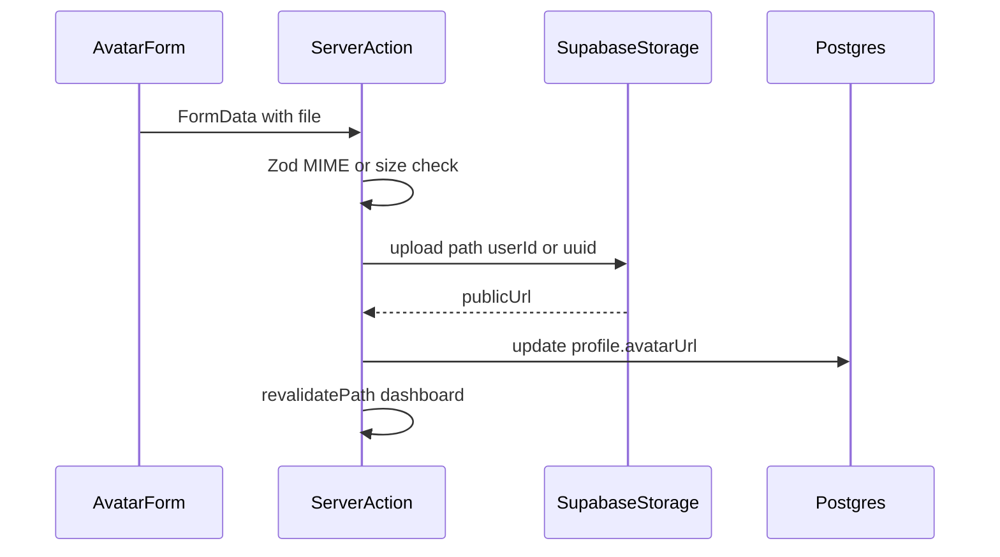

# プロフィールにアバターを追加する

## 現状

- プロフィール本体は `[db/schema.ts](db/schema.ts)` の `profile` テーブル（`userId` 一意）と `[app/schema.ts](app/schema.ts)` の Zod / `[app/actions/profile.ts](app/actions/profile.ts)` の `upsertProfile` で管理されている。
- Better Auth の `[user](db/schema.ts)` に既に `image`（nullable）があり、GitHub OAuth 等で埋まる場合がある。
- オブジェクトストレージ用 SDK は未導入（`[package.json](package.json)` に `@supabase/supabase-js` なし）。ローカル DB は `supabase` CLI を利用しているため、**Supabase Storage** を第一候補とする（本番も Supabase を使う想定で揃えやすい）。

## TDD（[AGENTS.md](AGENTS.md) に準拠）

実装フェーズは **テスト駆動** とする。

### 原則

- **Test List は計画**: `it.todo()` で列挙し、実装中に追加・削除してよい。
- **列挙とテストコードを分ける**: 先に「どの振る舞い・境界を検証するか」だけ列挙し、アサーションやセットアップは次ステップで書く（同時進行でケースが膨らむのを防ぐ）。
- **Red → Green → Refactor**: 1 ケースずつ `it.todo()` を `it()` にし、失敗を確認してから最小実装し、通ったらリファクタする。

### `/kiro/spec-tasks` 相当の順序

- **実装タスクの前に** 対応する **テストタスク** を置く。
- **テストが不要なタスク**（スキーマ定義・マイグレーション生成など）は **単独** でよい（[AGENTS.md](AGENTS.md) 該当節）。

### テスト哲学との整合（同ファイル・[.cursor/skills/nextjs-testing/SKILL.md](.cursor/skills/nextjs-testing/SKILL.md)）

- **バリデーション**は純粋関数に切り出し、**プライベート依存はモックしない**（Zod スキーマと `File` 境界のテストは実体でよい）。
- **共有依存**（DB）は実体＋順次実行を基本。Server Action 全体は **プロセス外依存**（`headers`、認証、Storage API）が絡むため、**核となる純粋部分を先にテスト**し、Action は薄く保つか、結合テストは少数に留める。
- **UI**: 既存の `[UserForm.test.tsx](app/components/UserForm.test.tsx)` と同様、**Server Action は `vi.mock`**（技術的制約）。

### 推奨するテストの切り口（先に書く順の目安）

1. **アバター用ファイル検証**（MIME・最大サイズ・空ファイルなど）— 純粋・高速・振る舞い単位。
2. **表示**: `avatarUrl` と `fallbackImage` の優先表示、プレースホルダ（イニシャル等）— コンポーネントは結果を見る。
3. **フォーム**: ファイル入力と送信（action モック）— 必要最小限。

Storage への実 PUT や認証付き Action の E2E 級は、Vitest 結合で賄えるなら Playwright は増やさない（AGENTS のピラミッド）。

## 方針

| 項目     | 内容                                                                                                                             |
| ------ | ------------------------------------------------------------------------------------------------------------------------------ |
| 保存先    | `profile.avatarUrl`（`text`、nullable）— カスタムアップロードの公開 URL のみ                                                                     |
| 表示優先度  | `profile.avatarUrl` → `session.user.image` → プレースホルダ（イニシャル等）                                                                   |
| アップロード | Server Action 内でファイル検証後、サービスロール等で Storage に PUT、返却 URL を DB に保存                                                                |
| フォーム   | [Conform + Zod + `useActionState](.cursor/skills/nextjs-form/SKILL.md)` で **アバター専用の小さなフォーム**（`type="file"`）。既存プロフィール本文フォームとは分離 |

## 実装タスク（TDD 順を意識した並び）

1. **ケース列挙のみ** — `it.todo()` またはメモでスコープ確定（アサーションは書かない）。
2. **テスト → 実装: ファイル検証**
  - Vitest で Red → `avatar` 用 Zod / ヘルパー（例: `[app/schema.ts](app/schema.ts)` 近傍または `lib/avatar-validation.ts`）を Green → Refactor。
3. **DB（テスト先行不要）**
  - `[db/schema.ts](db/schema.ts)` に `avatarUrl` を追加。
  - `pnpm db:generate` でマイグレーション。
4. **テスト → 実装: UI**
  - `ProfileCard` / `AvatarUploadForm` の振る舞いを Red → コンポーネント・配線を Green。
5. **ストレージ・Actions**
  - `@supabase/supabase-js`、サーバー専用 env、`[app/actions/avatar.ts](app/actions/avatar.ts)`（upload / 任意 remove）。
  - 検証は既に (2) でカバー済みを Action から呼ぶ。
6. **Next.js**
  - `[next.config.ts](next.config.ts)` の `images.remotePatterns`。
7. **環境例**
  - `[.env.example](.env.example)` に Supabase 用プレースホルダ。

## 代替案

- **ストレージを Vercel Blob にしたい**: `@vercel/blob` に差し替え。TDD の層分けは同じ（検証は純粋、PUT は境界）。
- **アップロードなし・OAuth のみ**: `profile` マイグレーション省略。表示のみならテストは表示ロジックに限定。

## リスク・注意

- **GitHub OAuth の `user.image`**: 上記優先度で `avatarUrl` が上書き表示の主役になる。
- **ローカル Supabase**: Storage バケットとキーが `.env.local` と一致していること。

## 実装後に自分でやること（手動チェックリスト）

コード実装が終わった **あと**、あなたが環境ごとに行う作業。実装時に決まった **バケット名・env 変数名** は `.env.example` と README/コメントに合わせて読み替える。

### 1. Storage バケットの作成

- **ローカル（Supabase CLI）**: Dashboard（通常 `http://127.0.0.1:54323`）の **Storage** で、計画どおりの名前（例: `avatars`）でバケットを **Public** または **サーバーアップロード用ポリシー付き Private** のどちらかで作成する。実装が「公開 URL を DB に保存」前提なら、公開読み取りが必要な設定に合わせる。
- **本番（Supabase クラウド）**: 同じく Dashboard の **Storage** で同名バケットを作成し、ローカルと **ポリシー方針を揃える**（誤設定だとアップロード失敗や一覧漏洩の原因になる）。

### 2. 環境変数をどこから取るか

| 変数の例（実装で確定）         | 取得元（ローカル）                                                        | 取得元（本番）                                                                                                            |
| ------------------- | ---------------------------------------------------------------- | ------------------------------------------------------------------------------------------------------------------ |
| Supabase プロジェクト URL | ターミナルで `pnpm db:status` または `pnpx supabase status` の **API URL** | [Supabase Dashboard](https://supabase.com/dashboard) → 対象プロジェクト → **Project Settings** → **API** → **Project URL** |
| サービスロールキー（サーバーのみ）   | `supabase status` の **service_role**（**秘密**。クライアントに載せない）         | 同 **API** ページの **service_role**（**Reveal**）                                                                        |
| （使用する場合）anon キー     | `supabase status` の **anon key**                                 | 同 **API** ページの **anon public**                                                                                     |

- `**.env.local`**: 上記を開発用に貼る。`service_role` は **Git にコミットしない**。
- **Vercel / その他ホスト**: 本番・Preview ごとに **Environment Variables** に同じ名前で登録。`service_role` は **Production のみ** に限定するなど運用ルールを決める。

### 3. 画像表示まわり

- `**next.config.ts` の `images.remotePatterns`**: 本番の Storage 公開 URL のホスト（例: `*.supabase.co` 配下）が実装と一致しているか確認。ホストが環境で違う場合は **デプロイ先の env に合わせて** 設定を足す。

### 4. 動作確認

- ローカルでアップロード → ダッシュボードに画像表示 → 本番でも同様。失敗時は **バケット名・ポリシー・env の typo・`remotePatterns`** を優先的に疑う。

### 5. （任意）仕様書・Kiro

- 機能を `.kiro/specs/` で管理している場合は、`/kiro/validate-impl` や人間レビュー用に、**バケット名と必須 env** を requirements/design に1行追記しておくと再現しやすい。

